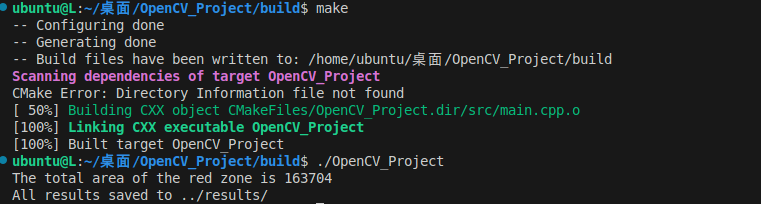
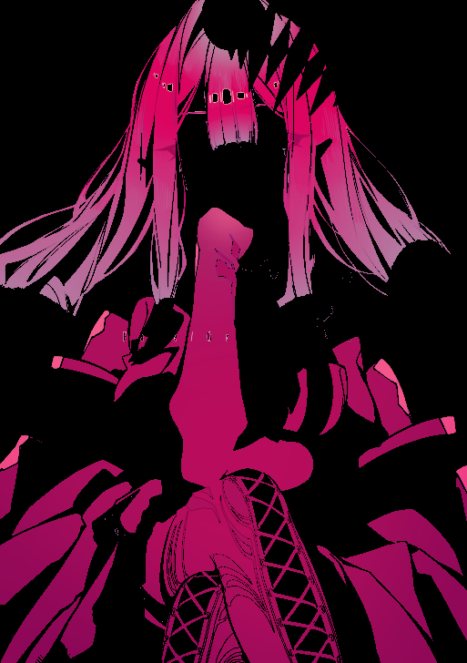
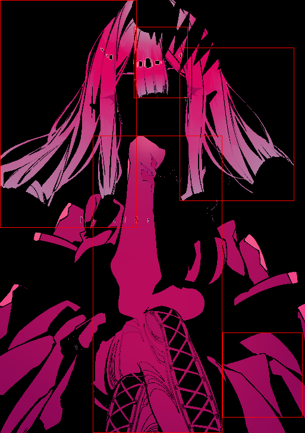
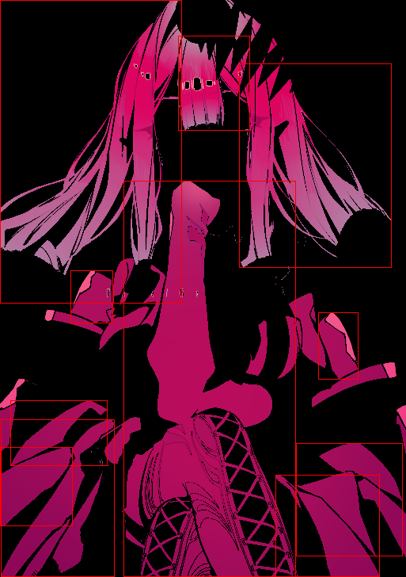

## 结果
每个步骤结果图片已保存至./results文件夹下，寻找红色轮廓面积输出截图如下:

## 思路
- 颜色转换和滤波不必多说，均值滤波和高斯滤波均使用3*3滤波核
- 提取红色区域部分，hsv调参的代码放在src/tune.cpp中，分别使用拉杆控制六个参数，最后确定效果比较好的一组，结果为
- 寻找轮廓，因为有的区域是中空的，所以用cv::RETR_TREE搭建树形轮廓，不能用external
- 找红色轮廓的bbox，有点没明白任务里“红色的bbox”，如果是整体轮廓，那就是图像边缘了；这里红色区域是一块一块的，我用面积筛了一下高于2000的contour
- 提取高亮区域，先转为hsv格式，筛选V大于200的区域，可以认为是高亮区域，之后的形态学操作也不用说

初版代码由AI完成，我逐个debug了所有结果，在这之上有删减和修改，除了找bbox有点不清楚什么意思，其余应该满足任务要求。

附寻找bbox中阈值2000和5000区别

5000:

 

2000:
